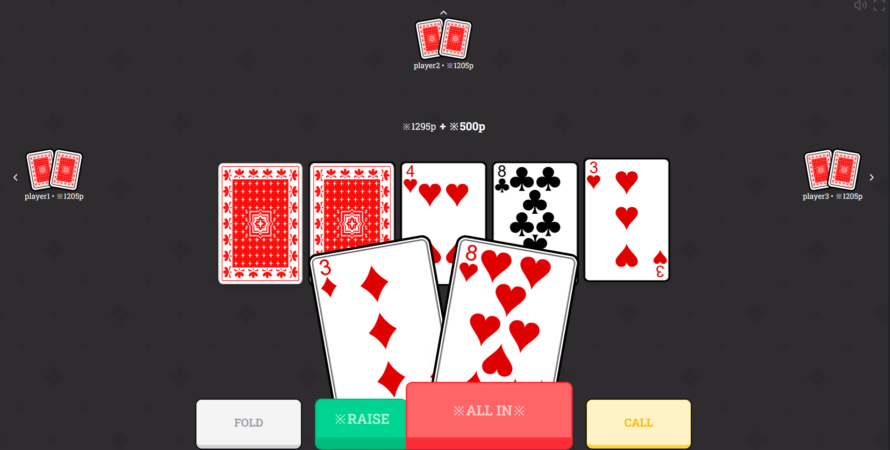

# Poker Hand Calculator (JavaScript Canvas)

A poker game built using **JavaScript** and the **HTML5 Canvas API**, featuring real-time poker hand calculation and evaluation logic.



## Features
- Poker hand calculation and ranking
- Canvas-based rendering (no external game engine)
- Simple, lightweight implementation
- Written in vanilla JavaScript

## Tech Stack
- JavaScript (ES6+)
- HTML5 Canvas
- HTML / CSS

## Getting Started

1. Clone the repository:
   ```bash
   git clone https://github.com/your-username/your-repo-name.git
